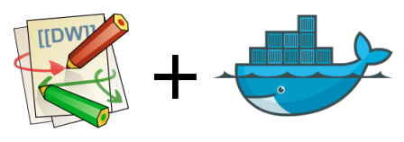

## About

[DokuWiki](https://www.dokuwiki.org/dokuwiki) Docker image based on Alpine Linux and Nginx. 
Inspired by [istepanov docker-dokuwiki](https://github.com/istepanov/docker-dokuwiki) repository.
